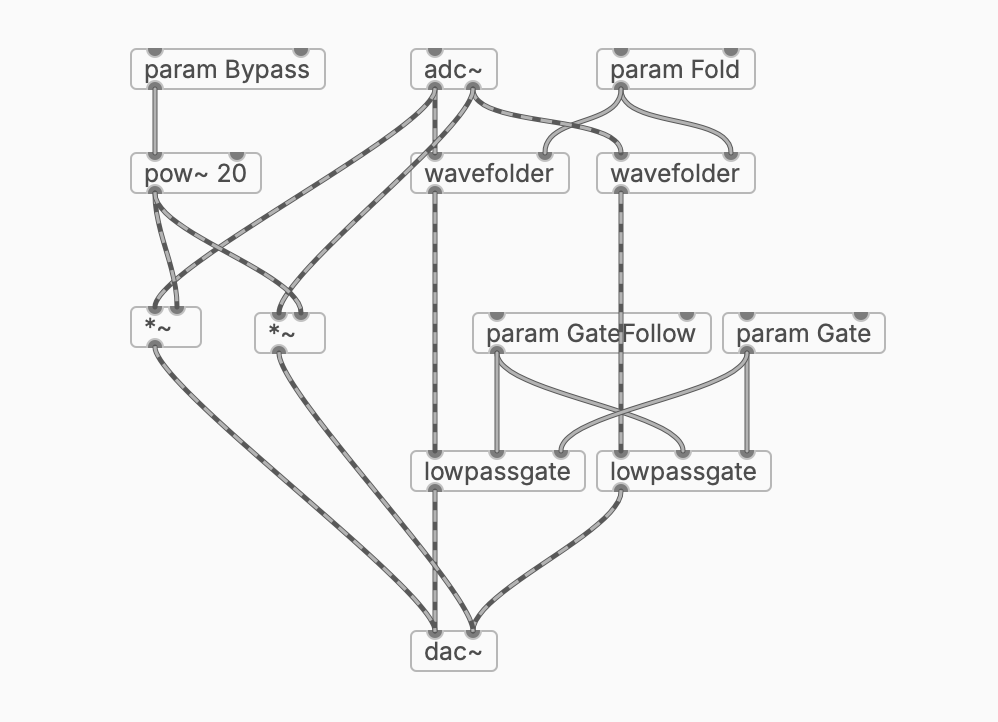

# plugdata-paperweight

Wave folder and low pass gate effect

## Installation

To use as a plugin in a daw, follow these steps:

1. install plug data
2. clone this repo
3. add plug data as an effect to a track in your daw
4. open paperweight.pd
5. add these automation parameters (right sidebar in plug data): Fold, Gate, GateFollow, Bypass
6. in your daw, save the effect as a preset called "paperweight"

## Parameters

**Fold**: Wave folding amount

**Gate**: Open or close the low pass gate (gate input, 1 or 0)

**GateFollow**: Amplitude opens low pass gate

**Bypass**: Dry signal

## Wave Folder

As wave folding increases, a low pass filter closes to filter out high frequencies that would distort the resulting folded wave.
The output signal is always clean and sqeaky without any harsh clipping.

## Low Pass Gate

A simple non-resonant filter with a natural decay when triggered. It can follow its input signal to act as a decompressor-like effect.